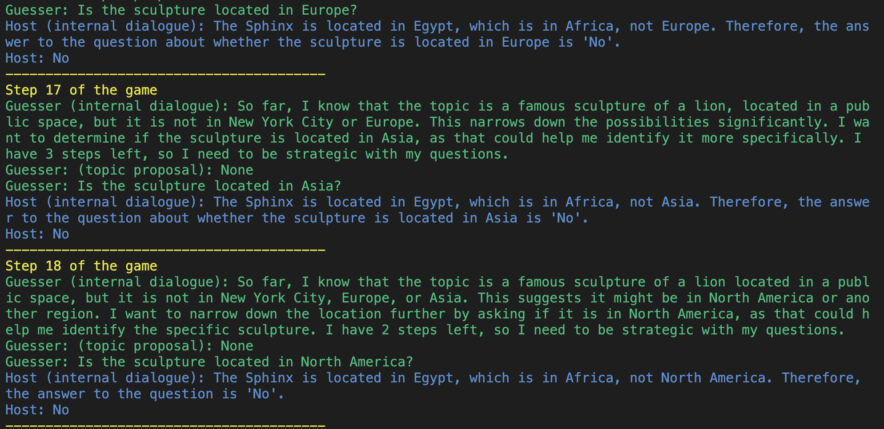

<p align="center">
  
</p>


# Steve HarvAI

<div style="display: flex; justify-content: space-between;">
    
    
</div>

This is a simple implementation of a "20 questions game", that I built to showcase the capabilities of the 
multi-agent interaction. The name "Steve HarvAI" is an homage to the famous (and hilarious) Steve Harvey, who hosted the popular
game show "Let's Make a Deal".


## Project structure
```
.
├── agents.py          # contains the agents definitions
├── game.py            # contains the game logic (main script)
├── messages.py        # contains the message objects
├── prompts.py         # contains the system prompts for the agents
├── tools.py           # contains the tools that the agents can use
├── utils.py           # contains utility functions
├── README.md          # this file
├── assets             # contains assets
├── pyproject.toml     # contains project metadata and dependencies
└── parallel_game.py   # contains the script for running multiple games in parallel (see game.py for details)
```

## Setup
```bash
# Create a virtual environment and install dependencies
uv venv && source .venv/bin/activate  
uv sync
```
Also, do not forget to set the `OPENAI_API_KEY` environment variable to your API key.

## Running

Whenever you run the game, it will create a new log file in the `game_logs` directory.
This way, you can either inspect the game progress in your terminal (with pretty coloring for easier reading)
or you can open the log file in a text editor to see the full game progress.

### Run One Game
```bash
# Run the game
python game.py
# You can also run the game with a specific topic
python game.py --topic "Sam Altman"
```

### Run Multiple Games in Parallel
```bash
# Run multiple games in parallel
# This will clear the logs directory before running (to avoid clutter), and run 20 games in parallel
python parallel_game.py \
--num_games 20 \ # number of games to run in parallel
--clear_logs \ # clear the logs directory before running; just for convenience (default: True)
```

The output will be a summary of all the games:
```bash
Games played: 40
Wins: 19
Losses: 21
Topics guessed correctly: ['Eiffel Tower', 'Eiffel Tower', 'Pyramids of Giza', 'The Great Wall of China', 'Eiffel Tower', 'Pyramids of Giza', 'Blender', 'The Great Wall of China', 'Kangaroo', 'Puzzle', 'Eiffel Tower', 'Eiffel Tower', 'Great Wall of China', 'Eiffel Tower', 'Machu Picchu', 'Kilimanjaro', 'The Great Wall of China', 'Taj Mahal', 'The Great Wall of China']
Topics not guessed: ['Pyramids', 'Eiffel Tower', 'Chocolate Cake', 'Eiffel Tower', 'Eiffel Tower', 'Cleopatra', 'Taj Mahal', 'Model Airplane', 'Sundial', 'Eiffel Tower', 'Taco', 'Pyramid', 'Volcano', 'Pyramids', 'Kilimanjaro', 'Parthenon', 'Pyramids', 'Lighthouse', 'Pyramids', 'Eiffel Tower', 'Pyramids']
```

## Things To Think About

### What main steps will there be?
I think that it is natural that step of the interaction should be one turn of the game.
This means that a single step would entail:
- The guesser generates a question
- The guesser picks a topic proposal (optionally)
- The host validates the topic proposal (optionally)
- The host answers the question (if the guesser has not guessed the topic)

### How will we get the agents to interact?
The agents will be two separate entities with clearly defined boundaries, so that there is no accidental 
knowledge leakage.
Both entities will be sharing the information between each other through messages. Every message that is 
external to the agent, will arrive to them in a form of a `UserMessage`. Those messages are then
stored in the agent's message history, and the agent will use that history to generate its new output through LLM call.
Message history is essentially a conversation history, or a "memory" of an agent.

In general I follow the ReAct framework: agents are reasoning, and then acting.

### What context does each agent have?
Each agent will have the following context:
- The appropriate system message
- The current step of the game (especially important for the Guesser, who needs to be aware of the steps left)
- The conversation history between the agents
Additionally, the Host also knows about the topic.

### What pieces could you keep static at first to simplify things?
What helped me initially to simplify the things:
- Keep system prompts short and laconic, not to induce unwanted, complex behavior early on.
- Keep a simple, constant topic for the early development and debugging (I chose 'Dog').
- Use a lightweight, reliable model (I chose `gpt-4o-mini`).
- Use response format to ensure that the output space of the agents is constrained and more deterministic.

### How do you want to handle errors and other issues?
Since my script is quite simple, I assume there will be no errors during the API calls. 
However, in my professional work, I noticed that errors do happen, so I:
- Retry the API calls a couple of times
- I have a fallback model in case the API completely fails (e.g. different API provider, different model, model without images etc.)
- Use a lightweight, local, model to approximate the output that I'd get from the LLM.
The rest of the logic is quite reliable. This is mostly due to the use of structured responses from the API.

### Reliability
Once I implemented a rough version of the game, I noticed that the flow of the game and the behavior of the 
agents is not always correct. This is why I decided to implement a `reasoning` field in the tools. This allowed me
to essentially "debug" the agents by checking what they are reasoning about, and hence understand if they "know what
they are supposed to know". This is how I realized that I swapped `SYSTEM_PROMPT_HOST` and `SYSTEM_PROMPT_GUESSER` in the code :3.
The reasoning should also serve as a CoT (Chain of Thought) prompting technique (note that `reasoning` field always comes as a first attribute of the tools `BaseModel`, this ensures that CoT is triggered BEFORE we generate the rest of the output).

### Evaluation
A simple evaluation that I implemented is to run the game multiple times and count the number of wins and losses.
```python parallel_game.py --num_games 100```
It is a simple evaluation, but already serves as a good baseline. It allows me have a rough idea which categories are easier or harder for the Guesser (obviously in my case animals, plans, mountains were harder then people or landmarks). I can quickly find out what is the average win rate, etc.

But there are several other aspects that evaluation should capture:
- We are in the multi-agent setting, so the agents influence each other. How to tell whether the Guesser has regressed or the Host has improved? We need to have joint, but also individual evaluation metrics, from which we could create one global evaluation metric (like with Generative Adversarial Networks or popular Self-Play AIs).
- How do we benchmark against human players?

We can vary the difficulty of the game by broadening or narrowing the category of the topic. I decided to go for all the 
tangible, real-world objects. However, once we start introducing abstract concepts, the game ought to get
much harder for the Guesser, as well as for the Host (to understand the topic and provide good answers).

### Testability
I parallelized the game so that we can run N multiple games in parallel.
```python parallel_games.py --num_games 5```
Each game (run), has its own unique uuid, and produces a color-coded log, that can be investigated after the run and potentially even analyzed by another LLM.

This uuid could be directly linked to the version of the system prompt, so that we could investigate the influence of the system prompts on the behavior of the agents.

At scale, I would probably write a small experiment managing script, that would use WandB or something similar, so that I could quickly analyze and inspect the results.

### Be sure to note down where the agents get stuck
Sometimes the Guesser does a "breadth-first search" of the topic space, which takes a lot of turns.
For example, the Host chose the topic `Eiffel Tower`. The Guesser instead of asking `Is this building in Europe?` to quickly
narrow down the search space, just asking: `Is this building a museum?`, `An art gallery?`, `A historical landmark?`, etc. Some additional prompting would help here to make the Guesser be more strategic.
Also, I keep struggling with the variety of the topics that the Host is coming up with. Even thought I tried hard to nudge it toward
diverse topics (high temperature, prompts, adding random seed to break prompt caching) - and it helped to some degree - I still see repetitions in the topics. 

### How did you resolve some of the issues you encountered?
- I added a `reasoning` field to the tools, which helps me understand what the agents are reasoning about.
- I tinkered with the system prompts to nudge the agents toward "good behavior" (e.g. asking good questions).
- Initially I also restricted category of questions to animals-only, which helped me with debugging.
- I implemented several improvements for generating more diverse topics.

### Which issues are still outstanding? How might you solve them if you had more time?
I managed to get to a working solution quite quickly, and I am pretty happy with the result. Probably doing some more
prompt engineering could help, but I would quickly hit diminishing returns. While I am very happy with the Host's behavior, the quality of the Guesser might improve if we used majority voting between multiple guesses either from the same model or several different models combined (gpt-4, sonnet, etc..).
Also, I'd take more time to figure about why the generated topics are not diverse and try to fix it!
Also, I could not make the Guesser to be more aggressive with proposing topics, even when it's unsure about the answer.

### What future work would you explore, perhaps beyond prompt engineering?
I wonder how would better model (o1-preview or o1-mini) perform? Due to their latency, and costs I haven't tested them.
Also, I would try to force the Guesser to use the time more strategically. An idea would be to make it explore the "depth"
of the problem for first couple of turns, but then closer to the end, really focus on trying to guess the topic. What would definitely help is for the Guesser to have experience of playing multiple games in the past, so it can use it to inform its strategy for the future games.


